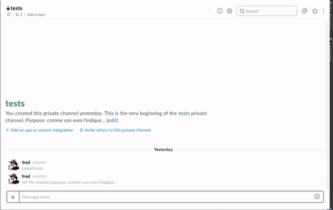

# kaamelott-slack

Une adaptation Clojure de l'original et excellent **https://github.com/mmetesreau/kaamelott-slack-command**

## Usage

###App Slack

D'abord, créer une app Slack (seules les apps gèrent les messages interactifs).

Pas le temps de trop rentrer dans les détails, faites donc un tour sur 
**https://api.slack.com/apps**

Dans cette app, il faudra créer une commande 'slash' pour lancer l'execution du script 
(voir https://api.slack.com/slash-commands).

Dans le GIF qui montre l'install sur un Slack de test, j'ai utilisé la commande "/arthour", mais c'est vous qui décidez... 
(j'avais aussi dans l'idée "/interprète", mais un peu long...).

###Ajouter des clés d'environnement

    slack_oauth_token
    slack_validation_token

contenant respectivement un token d'accés Slack valide
et le token de vérification généré lors de la création de la commande Slack.

## License

Copyright © 2017 Ikarius

Distributed under the Eclipse Public License either version 1.0 or (at
your option) any later version.
